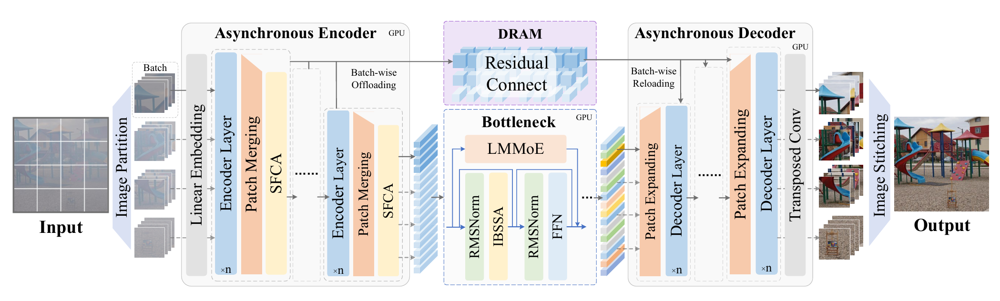
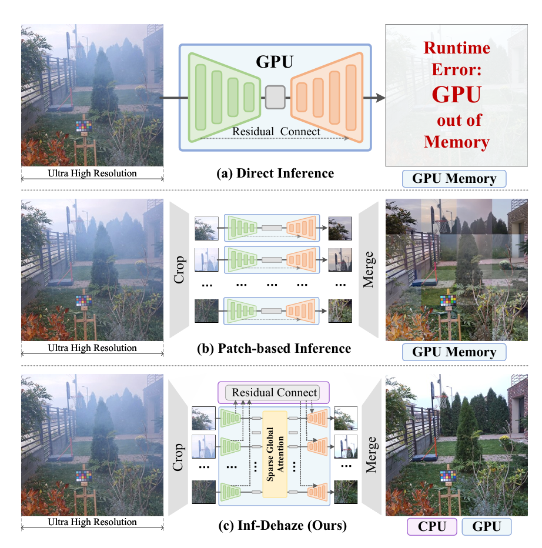
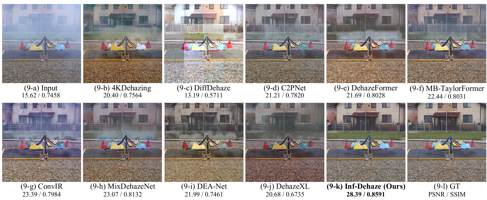

# Inf-Dehaze: Beyond GPU Memory Constraints for Ultra-High-Resolution Image Dehazing (CVPR 2026 Findings)

Official PyTorch implementation of **Inf-Dehaze**, a memory-efficient dehazing framework for ultra-high-resolution images.

<p align="center">
  <a href="https://openaccess.thecvf.com/content/CVPR2026F/html/Yan_Inf-Dehaze_Beyond_GPU_Memory_Constraints_for_Ultra-High-Resolution_Image_Dehazing_CVPRF_2026_paper.html"><b>Paper</b></a> &nbsp;|&nbsp;
  <a href="https://github.com/fengyanzi/Inf-Dehaze"><b>Code</b></a>
</p>

Image dehazing is a fundamental computer vision task that aims to address image degradation caused by haze. Existing deep learning models have achieved remarkable performance on small or low-resolution images. However, with the continuous increase in imaging system resolution, removing haze from ultra-high-resolution images has become an urgent challenge in real-world applications. Due to GPU memory constraints, prior methods typically rely on patch-based inference, which disrupts global spatial consistency and introduces blocking artifacts.

**Inf-Dehaze** addresses this issue with:

1. A customized **Swin encoder** to capture coarse haze distributions at patch level.
2. An efficient **bottleneck** that fuses local details with global context via **IBSSA** (Intra-Block Sparse Self-Attention) and **LMMoE** (Local Modeling Mixture-of-Experts).
3. A memory-friendly **inference framework** based on residual caching and asynchronous batch-based processing.

Extensive experiments demonstrate that Inf-Dehaze can process images up to **20,000 × 20,000** pixels using only **~7.7 GB** GPU memory, achieving competitive speed and state-of-the-art performance.

---

## Overview

<p align="center">
  
</p>
<p align="center"><sub><b>Figure 1.</b> Overall architecture of Inf-Dehaze. The encoder processes 256×256 region tiles; the bottleneck reassembles global context via IBSSA and LMMoE; the decoder reconstructs the dehazed image with skip connections.</sub></p>

<table align="center" width="100%">
  <tr>
    <td align="center" width="50%">
      
      <br/>
      <sub><b>Figure 2.</b> Comparison with patch-based and global-context methods.</sub>
    </td>
    <td align="center" width="50%">
      
      <br/>
      <sub><b>Figure 3.</b> Visual dehazing results on ultra-high-resolution images.</sub>
    </td>
  </tr>
</table>

---

## Installation

```bash
git clone https://github.com/fengyanzi/Inf-Dehaze.git
cd Inf-Dehaze

conda create -n inf-dehaze python=3.10
conda activate inf-dehaze

# Install PyTorch matching your CUDA version
pip install torch torchvision --index-url https://download.pytorch.org/whl/cu124

pip install -r requirements.txt
```

> Install a PyTorch build that matches your CUDA toolkit. See the [PyTorch installation guide](https://pytorch.org/get-started/locally/).

---

## Project Structure

```
Inf-Dehaze/
├── asset/                      # Figures for README and paper
├── configs/
│   └── dehaze_default.yaml     # Model, training, and inference settings
├── inf_dehaze/                 # Core model package
│   ├── model.py                # Top-level InfDehaze model
│   ├── attention/
│   │   ├── ibssa.py            # Intra-Block Sparse Self-Attention (IBSSA)
│   │   └── lmmoe.py            # Local Modeling Mixture-of-Experts (LMMoE)
│   ├── backbone/
│   │   ├── swin_backbone.py    # Swin encoder / decoder
│   │   └── bottleneck.py       # IBSSA + LMMoE bottleneck blocks
│   ├── data/
│   │   └── dataset.py          # Training datasets
│   └── utils/
│       └── pos_embed.py        # Sincos positional embeddings
├── train.py                    # Training entry point
├── infer.py                    # Single-image inference
└── test_model.py               # Smoke / training / VRAM tests
```

---

## Model Overview

Inf-Dehaze follows an encoder–bottleneck–decoder design:

| Component | Role |
|-----------|------|
| **Encoder** | Swin Transformer stages process 256×256 region tiles independently and cache skip features on CPU during inference. |
| **Bottleneck** | Reassembles all tiles into a full-resolution feature map, applies alternating **IBSSA** / standard attention blocks, each paired with an **LMMoE** local branch. |
| **Decoder** | Mirrors the encoder with skip connections to reconstruct dehazed RGB output. |
| **Inference** | Residual caching + async batch processing overlap GPU compute with CPU I/O, dramatically reducing peak VRAM. |

Key modules (paper ↔ code):

| Paper Name | Code |
|------------|------|
| Intra-Block Sparse Self-Attention (**IBSSA**) | `inf_dehaze/attention/ibssa.py` |
| Local Modeling Mixture-of-Experts (**LMMoE**) | `inf_dehaze/attention/lmmoe.py` |

Configure block types in `configs/dehaze_default.yaml`:

```yaml
bottleneck:
  layer_types: ["ibssa", "sa", "ibssa", "sa"]
  moe_scale: 0.1
```

---

## Dataset

We recommend the **8KDehaze** dataset from our prior work [DehazeXL](https://github.com/CastleChen339/DehazeXL) for training ultra-high-resolution dehazing models.

### Directory layout

```
8KDehaze/
├── clear/               # Haze-free ground truth
│   ├── image1.png
│   └── ...
├── cloud_0/             # Haze level 0 (light)
├── cloud_1/
├── cloud_2/
├── cloud_3/
└── cloud_4/             # Haze level 4 (dense)
```

For the larger variant used with `DehazeDatasetBig`, haze folders are named `cloud_L1` … `cloud_L4`.

### Download

- **Mini (recommended for quick experiments)**: [ModelScope](https://www.modelscope.cn/datasets/fengyanzi/8kdehaze_mini/) · [Hugging Face](https://huggingface.co/datasets/fengyanzi/8KDehaze_mini)
- **Full**: [Hugging Face](https://huggingface.co/datasets/CastleChen339/8KDehaze/tree/main)

Place the dataset at `./datasets/8KDehaze` or update `training.data_dir` in the config file.

### Data loading

`inf_dehaze/data/dataset.py` provides:

- `DehazeDataset` — standard training with random haze level and 1024×1024 crop (default).
- `DehazeDatasetBig` — 2048×2048 crops with `cloud_L1`–`cloud_L4`.
- `DehazeDatasetExpanded` — iterate all haze levels deterministically.
- `PairedDehazeDataset` — generic paired folders for real-world benchmarks.

During training, input images must be divisible by `model.crop_size` (default **256**). The model splits an image into a grid of 256×256 region tiles internally.

---

## Usage

### Quick sanity check

Run unit tests from the project root (CUDA recommended for large-image tests):

```bash
python test_model.py
```

### Training

Default settings are in `configs/dehaze_default.yaml`. Override via CLI:

```bash
python train.py \
  --config ./configs/dehaze_default.yaml \
  --data_dir ./datasets/8KDehaze \
  --save_dir ./checkpoints/train \
  --batch_size 4 \
  --epochs 100 \
  --lr 1e-4
```

| Argument | Description | Default |
|----------|-------------|---------|
| `--config` | YAML config path | `./configs/dehaze_default.yaml` |
| `--data_dir` | Dataset root | from config |
| `--save_dir` | Checkpoint directory | `./checkpoints/train` |
| `--resume` | Resume checkpoint | `null` |
| `--batch_size` | Training batch size | `4` |
| `--crop_size` | Random crop size | `1024` |
| `--epochs` | Training epochs | `100` |
| `--save_cycle` | Save checkpoint every N epochs | `1` |
| `--num_workers` | DataLoader workers | `8` |
| `--normalize` | Apply dataset normalization | off |
| `--no-cuda` | Force CPU training | off |

Checkpoints are saved as `last.pth` and periodic `step_*.pth` files. Training logs are written to `train.log` inside `--save_dir`.

> Reduce `--batch_size` if you encounter OOM errors. Multi-GPU training uses `DataParallel` automatically when multiple GPUs are detected.

### Inference

Process a single hazy image with memory-efficient tiled inference:

```bash
python infer.py \
  --input ./path/to/hazy.png \
  --model_path ./checkpoints/train/last.pth \
  --output_dir ./results \
  --fp16
```

| Argument | Description | Default |
|----------|-------------|---------|
| `--config` | YAML config path | `./configs/dehaze_default.yaml` |
| `--input` | Hazy input image | required |
| `--model_path` | Model checkpoint | required |
| `--output_dir` | Output directory | `./results` |
| `--inference_batch_size` | Tiles per forward pass | from config (`4`) |
| `--resize W H` | Optional resize before inference | none |
| `--fp16` | Half-precision inference | off |
| `--no-cache` | Disable CPU residual caching | off |
| `--sync-io` | Disable async CPU transfer | off |
| `--normalize` | Normalize input (match training) | off |
| `--no-cuda` | Force CPU inference | off |

The script automatically pads the image so height and width are multiples of `crop_size` (256), then crops the output back to the original size.

### Programmatic usage

```python
import torch
from inf_dehaze import InfDehaze

model = InfDehaze.from_config("./configs/dehaze_default.yaml")
model.load_state_dict(torch.load("checkpoints/train/last.pth", weights_only=True))
model.eval().half().cuda()

with torch.no_grad():
    output = model(hazy_tensor)  # (1, 3, H, W), H/W divisible by 256
```

---

## Inference Strategies

Inf-Dehaze supports three inference modes (see `test_model.py`, Test 4):

| Mode | `use_residual_cache` | `async_io` | Description |
|------|---------------------|------------|-------------|
| Async + cache | `true` | `true` | **Recommended.** Overlaps CPU skip transfer with GPU compute. |
| Sync + cache | `true` | `false` | CPU caching without async overlap. |
| No cache | `false` | — | All tensors on GPU; highest VRAM, for small images. |

Tune `inference.batch_size` in the config to balance speed and memory. Larger batch sizes improve throughput but increase peak VRAM.

---

## Citation

If you find this work useful, please cite:

```bibtex
@InProceedings{Yan_2026_CVPR,
    author    = {Yan, Xinyu and Chen, Jiuchen and Xu, Qizhi},
    title     = {Inf-Dehaze: Beyond {GPU} Memory Constraints for Ultra-High-Resolution Image Dehazing},
    booktitle = {Proceedings of the IEEE/CVF Conference on Computer Vision and Pattern Recognition (CVPR) Findings},
    month     = {June},
    year      = {2026},
    pages     = {5086--5095}
}
```

Related prior work:

```bibtex
@InProceedings{Chen_2025_CVPR,
    author    = {Chen, Jiuchen and Yan, Xinyu and Xu, Qizhi and Li, Kaiqi},
    title     = {Tokenize Image Patches: Global Context Fusion for Effective Haze Removal in Large Images},
    booktitle = {Proceedings of the Computer Vision and Pattern Recognition Conference (CVPR)},
    month     = {June},
    year      = {2025},
    pages     = {2258--2268}
}
```

---

## Contact

For questions or suggestions, please open an issue on GitHub or contact the authors.

## Acknowledgements

This work builds upon our prior dehazing framework [DehazeXL](https://github.com/CastleChen339/DehazeXL). We thank the authors of [Swin Transformer](https://github.com/microsoft/Swin-Transformer) and [timm](https://github.com/huggingface/pytorch-image-models) for their open-source implementations.
